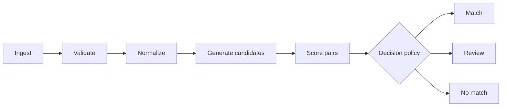

# Entity Resolution Engine

[](https://github.com/JhoCruz/entity-resolution-engine/actions/workflows/ci.yml)
[](https://www.python.org/)
[](LICENSE)

Auditable entity resolution for messy CSV and Excel data, with deterministic exact matches,
bounded name and date candidates, weighted similarity, and separate local report views.

> **Project status:** `v1.0.0` is a local command-line workflow with reduced and opt-in full
> audit reports. The default approximate matching behavior is conservative.
> Name and date candidates require review by default. An explicitly selected synthetic policy
> demonstrates calibrated decisions; it is not validated for real-world records.
> Baseline accuracy has been measured only on invented records; scale has not been measured yet.

Start with the [v1.0.0 release guide](docs/RELEASE_1_0.md) for runnable examples, evidence, and
limits.

## The problem

Two datasets can describe the same real-world entity without sharing identical values:

```text
JOAO DA SILVA       <-> João Silva
123.456.789-00      <-> 12345678900
(48) 99999-1234     <-> 48999991234
```

Exact joins miss these relationships. Unrestricted fuzzy matching is expensive and can create
confident-looking false positives. This project aims to produce decisions that are both useful
and inspectable, including an explicit **review** outcome when evidence is insufficient.

## Planned pipeline



The initial implementation includes the typed decision policy that separates automatic matches
from records requiring human review, validated TOML contracts, CSV/XLSX loaders that preserve
source values and row provenance, and source validation that blocks missing columns or invalid
record identifiers without exposing their values. Normalization now produces auditable comparison
keys for text, names, identifiers, phones, dates, and e-mails. Unsupported or ambiguous structured
values carry an issue and no comparison key.
The exact baseline finds candidates through normalized identifiers and produces `match` or
`review` with field evidence and stable reasons. Two name-based keys and a fallback exact-date
key find additional pairs, which receive weighted field similarities and a `review` outcome.
A similarity score is not the probability that a pair is correct. Pairs never compared remain
unresolved.

## Quick start

Requirements: Python 3.12 or newer. [`uv`](https://docs.astral.sh/uv/) is recommended.

```bash
git clone https://github.com/JhoCruz/entity-resolution-engine.git
cd entity-resolution-engine
uv sync --locked --extra dev
uv run entity-resolution-engine doctor
uv run entity-resolution-engine check-config examples/basic-job.toml
uv run entity-resolution-engine inspect --config examples/basic-job.toml
uv run entity-resolution-engine baseline --config examples/basic-job.toml
uv run entity-resolution-engine candidates --config examples/name-variants-job.toml
uv run entity-resolution-engine reconcile --config examples/name-variants-job.toml --output reports/variants
uv run entity-resolution-engine reconcile --config examples/basic-job.toml --output reports/exact
```

The `inspect` command executes the complete first milestone: it loads both configured sources,
validates their schemas and record identifiers, and prints row counts, mapped fields, warnings, and
validation status. It never prints record values, and it states explicitly that matching has not run.
The `baseline` command checks exact identifiers and supporting fields; `candidates` also counts
new pairs found from variations in person names. The `reconcile` command runs the whole pipeline
and writes a summary and four JSON Lines files: `matches.jsonl`, `reviews.jsonl`,
`non_matches.jsonl`, and `conflicts.jsonl`. Conflicts are also in `reviews.jsonl`.
The output directory must be new. These reports contain counts, random references that change
each run, numeric evidence, and reasons; they contain no source values or source row numbers.
`non_matches.jsonl` is empty in the default conservative mode. With an explicit calibration file,
low-scoring name candidates can be rejected. Unseen pairs do not become non-matches just because
blocking omitted them.

For an explicitly requested local audit with the original and normalized values:

```bash
uv run entity-resolution-engine reconcile --config examples/name-variants-job.toml \
  --output reports/variants-audit --full-audit
```

This additionally writes `full/normalized_left.jsonl`, `full/normalized_right.jsonl`, and
`full/audit.jsonl` under the new output directory. The audit files and directory are readable
only by the current user where supported. Treat the full view as personal data if you run the
tool on real people. The sample data in this repository is synthetic. See
[`docs/REPORTS.md`](docs/REPORTS.md) for the report format and limitations.

Reproduce baseline evaluation on labeled synthetic sources with:

```bash
uv run python scripts/evaluate_benchmark.py --output docs/evaluation/baseline.json
```

See [`docs/EVALUATION.md`](docs/EVALUATION.md) for the metrics, fixed seeds, and limits. These
synthetic results do not predict performance on real customer records.
For an **opt-in synthetic demonstration**, generate the example split and run the policy tuned on
the separate tuning split:

```bash
uv run python scripts/generate_benchmark.py --output-directory benchmarks/final --seed 20260925
uv run entity-resolution-engine reconcile --config benchmarks/final/job.toml \
  --output reports/final-calibrated --calibration docs/evaluation/synthetic-policy.json
```

Regenerate the policy and its held-out evaluation with
`uv run python scripts/calibrate_policy.py --output docs/evaluation/synthetic-policy.json`.
See [`docs/CALIBRATION.md`](docs/CALIBRATION.md) for safeguards and limitations.
For a local timing and candidate-count example, run
`uv run python scripts/benchmark_performance.py --output docs/evaluation/performance.json`.
See [`docs/PERFORMANCE.md`](docs/PERFORMANCE.md) before interpreting the numbers.

Run the complete quality gate:

```bash
uv run ruff check .
uv run ruff format --check .
uv run mypy src tests
uv run pytest
```

Without `uv`, create a virtual environment and install the package with its development tools:

```bash
python -m venv .venv
python -m pip install --editable ".[dev]"
```

## Design principles

- **Auditable before clever:** every match should expose the evidence behind its score.
- **Abstention is a feature:** uncertain pairs go to review instead of being forced into a match.
- **Deterministic baseline first:** approximate and learned approaches must beat a simple baseline.
- **Privacy by construction:** examples and benchmarks use reproducible synthetic data only.
- **Measured claims:** accuracy and performance numbers require committed evaluation artifacts.
- **One-command reproducibility:** a reviewer should be able to run tests and examples locally.

## Repository structure

```text
entity-resolution-engine/
├── .github/                     # CI and contribution templates
├── data/                        # Synthetic-data policy and future generated samples
├── docs/                        # Architecture, decisions, and milestone plan
├── examples/                    # Reproducible synthetic job configurations
├── src/entity_resolution_engine/
├── tests/
├── Dockerfile
└── pyproject.toml
```

## Roadmap

1. Define data contracts and load CSV/XLSX inputs.
2. Normalize identifiers, names, dates, e-mails, and phone numbers.
3. Establish deterministic exact-match rules.
4. Add candidate blocking and weighted fuzzy scoring.
5. Generate labeled synthetic data and evaluate precision, recall, and F1.
6. Benchmark runtime and memory, then publish a stable CLI workflow.

See [`docs/ROADMAP.md`](docs/ROADMAP.md) for acceptance criteria and explicit non-goals.
The configuration format is documented in
[`docs/CONFIGURATION.md`](docs/CONFIGURATION.md).
The baseline transformation contract is documented in
[`docs/NORMALIZATION.md`](docs/NORMALIZATION.md).
The first decision rules are documented in
[`docs/EXACT_BASELINE.md`](docs/EXACT_BASELINE.md).
Name and date candidate keys and their limits are documented in
[`docs/NAME_BLOCKING.md`](docs/NAME_BLOCKING.md) and
[`docs/DATE_BLOCKING.md`](docs/DATE_BLOCKING.md).

## Data and privacy

No employer data, internal system names, private documents, or real personal information belong in
this repository. Benchmark records use curated Brazilian-style names and invented identifiers,
with fixed seeds, controlled corruptions, and separate ground truth.
The CLI prints counts and output locations only. The reduced report uses fresh opaque references
per run; these do not prove legal anonymization. The opt-in full audit contains original and
normalized values. Keep all outputs under `reports/` (ignored by Git), or outside the repository.

## License

Released under the [MIT License](LICENSE).
