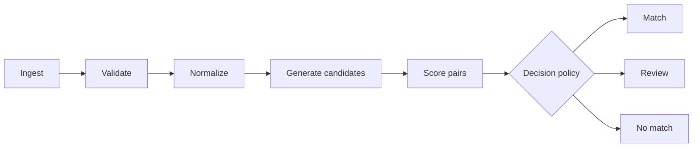

# Entity Resolution Engine

[](https://github.com/JhoCruz/entity-resolution-engine/actions/workflows/ci.yml)
[](https://www.python.org/)
[](LICENSE)

Auditable entity resolution for messy CSV and Excel data, combining deterministic rules,
candidate blocking, fuzzy similarity, and confidence-based abstention.

> **Project status:** repository foundation (`v0.1.0-dev`). The matching pipeline is being
> implemented incrementally; no performance or accuracy claims are made yet.

## The problem

Two datasets can describe the same real-world entity without sharing identical values:

```text
JOAO DA SILVA       <-> João Silva
123.456.789-00      <-> 12345678900
(48) 99999-1234     <-> 48999991234
```

Exact joins miss these relationships. Unrestricted fuzzy matching is expensive and can create
confident-looking false positives. This project aims to produce decisions that are both useful
and inspectable, including an explicit **review** outcome when evidence is insufficient.

## Planned pipeline



The initial implementation already includes the typed decision policy that separates automatic
matches from records requiring human review. Ingestion and matching are the next milestones.

## Quick start

Requirements: Python 3.12 or newer. [`uv`](https://docs.astral.sh/uv/) is recommended.

```bash
git clone https://github.com/JhoCruz/entity-resolution-engine.git
cd entity-resolution-engine
uv sync --locked --extra dev
uv run entity-resolution-engine doctor
```

Run the complete quality gate:

```bash
uv run ruff check .
uv run ruff format --check .
uv run mypy src tests
uv run pytest
```

Without `uv`, create a virtual environment and install the package with its development tools:

```bash
python -m venv .venv
python -m pip install --editable ".[dev]"
```

## Design principles

- **Auditable before clever:** every match should expose the evidence behind its score.
- **Abstention is a feature:** uncertain pairs go to review instead of being forced into a match.
- **Deterministic baseline first:** approximate and learned approaches must beat a simple baseline.
- **Privacy by construction:** examples and benchmarks use reproducible synthetic data only.
- **Measured claims:** accuracy and performance numbers require committed evaluation artifacts.
- **One-command reproducibility:** a reviewer should be able to run tests and examples locally.

## Repository structure

```text
entity-resolution-engine/
├── .github/                     # CI and contribution templates
├── data/                        # Synthetic-data policy and future generated samples
├── docs/                        # Architecture, decisions, and milestone plan
├── src/entity_resolution_engine/
├── tests/
├── Dockerfile
└── pyproject.toml
```

## Roadmap

1. Define data contracts and load CSV/XLSX inputs.
2. Normalize identifiers, names, dates, e-mails, and phone numbers.
3. Establish deterministic exact-match rules.
4. Add candidate blocking and weighted fuzzy scoring.
5. Generate labeled synthetic data and evaluate precision, recall, and F1.
6. Benchmark runtime and memory, then publish a stable CLI workflow.

See [`docs/ROADMAP.md`](docs/ROADMAP.md) for acceptance criteria and explicit non-goals.

## Data and privacy

No employer data, internal system names, private documents, or real personal information belong in
this repository. Benchmark records will be generated with Faker's `pt_BR` locale and controlled
corruptions, with a fixed seed and known ground truth.

## License

Released under the [MIT License](LICENSE).
